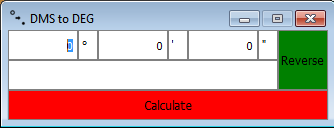

# DMS to DEG (dmstodeg)

Is a simple app for conversion of angle values (decimal to degrees, minutes,
seconds)

## Installation
Windows: Unpack .zip with the application to any directory.

## Usage
  

Сразу после запуска открывается окно программы в режиме перевода градусов, минут
и секунд в десятичные градусы. В соответствующие поля ввода необходимо ввести
значения и нажать "Calculate" (или Enter/Return на клавиатуре). В нижней строке окна отобразится результат. Вводить можно только числа от 0 до 360 в поле градусы и от 0 до 60 в поля минуты и секунды.

Для перехода в режим перевода из десятичных градусов в градусы, минуты и секунды
нажать кнопку "Reverse", поля ввода поменяются местами и поле десятичных
градусов станет доступно для ввода. Ввести значение и нажать "Calculate" (или
Enter/Return на клавиатуре). Вводить можно только числа от 0 до 360.
